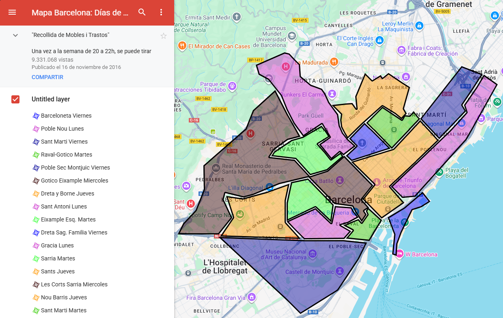
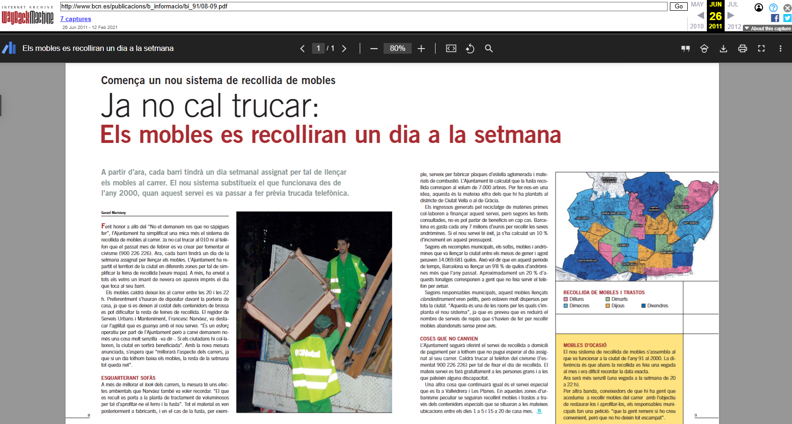

---
authors:
- admin
date: "2025-02-01"
image:
  caption: 'Panel from the webcomic Emmy the Robot by [**Dominic Cellini**](https://www.webtoons.com/en/canvas/emmy-the-robot/list?title_no=402201)'
summary: 'This title is all but accessible. Mapping the calendar of furniture (trastos) collection from Barcelona Ajuntament website.'
tags:
- Pet project
- Me
- Data
title: "Accesibble Frugality: Barcelona Trastos Map and Data"
---

### Proverb

"One man's trash is another man's treasure" is a ~~proverb~~ [pithicism](https://wordlust.blogspot.com/2006/10/pithicism.html) that, when taken literally, could lead you to some interesting finds.

<figcaption>Figure 1. The beer was not found in the trash. Taken in Paris, France, 2022.</figcaption>

In the city of Barcelona, Catalonia, every day is a good opportunity to find something interesting among the junk and laid waste.

On the streets, people tend to pick up from the trash for a few reasons.

Some do it out of necessity, or desperation, as is the case of the [more than ~3,000](https://www.ecologiapolitica.info/recicladores-informales-barcelona/) _'trash scavengers'_(English) roaming among containers for pieces of metal and other scraps to make a living out of recycling. 

This is for many a profession, often informal, and nowadays predominantly associated with immigrants, despite the trade having [a long history within locals](https://www.youtube.com/watch?v=LbjgCCcCOl4) going back centuries, with some _'drapaires'_(Catalan) having achieved [long-lasting cultural legacies](https://catalunyaplural.cat/ca/cal-drapaire-o-la-genesis-duna-llegenda/).

And it is also a business worth almost 10,000 million euros, in which recycling is estimated to move [1% of the country GDP every year](https://distintaslatitudes.net/indispensables-pero-invisibles/migrantes-chatarreros-en-barcelona).

Chances are, you have also seen or met your local _'chatarrero'_(Spanish) at one time or another.

<figcaption>Figure 2. </figcaption>

Other individuals pick up trash in a more recreational manner, almost as if it were a sport, or some form of [safari](https://web.archive.org/web/20090520052742/http://www.basurama.org/safaribasura.htm) in which you are hunting for furniture that could be salvaged or restored. 

Among privileged immigrants, furnishing your new apartment with something found on the streets tends to be almost an universal experience.

<figcaption>Figure 3. </figcaption>

Similar to thrifting clothes, sometimes all it takes is one thrifted treasure to change everything.

### Beggars can't be choosers

"Where and when can I salvage old, abandoned, furniture in Barcelona?"

This is a question that my friends, friends of friends, coworkers and myself have asked from time to time (as unlikely as it may sound).

Unfortunately, the town hall (Ajuntament/Municipality) of Barcelona only displays this information for individual street searches.

<figcaption>Figure 4. </figcaption>

This makes it ~~impossible~~ annoyingly difficult to have a simple map with exact locations and dates in order to plan for any trash rummaging expedition. 

And although some maps exist for specific districts, a single image containing all of the information remains elusive.

### A picture is worth a thousand words

In 2010 Zara Patterson was the first to make a public online map with information regarding when, and where, one could throw (or in this case, find) old furniture in the streets of Barcelona.

She did so as part of her blog ["Caer en Gracia"](https://caerengracia.wordpress.com/) where she ["lists resources to carry on restoration and renovation works ecologically"](https://caerengracia.wordpress.com/eco-recursos/).

<figcaption>Figure 5. </figcaption>

Unfortunately, the map has a few inaccuracies, with certain neighborhoods within districts not displaying the right pick up day of the week.

The map was last updated in 2016.

A second map, of low resolution and similarly outdated, sometimes also [makes the rounds within the internet](https://vaciadosbarcelona.com/dia-de-recogida-de-muebles-en-barcelona/). It was originally from a 2011 article that is no longer accessible [unless you use the Wayback Machine](https://web.archive.org/web/20110626070437/http://www.bcn.es/publicacions/b_informacio/bi_91/08-09.pdf).

<figcaption>Figure 6 </figcaption>

### There is more than one way to skin a cat

Since I couldn't find a complete map of Barcelona with the days of the week in which furniture/trastos is collected, I have compiled the data from the Ajuntament website and made my own maps.

For this the 

### It is what it is

And if you are reading this, they are now yours too.

You are here early - For now, information is located at:

https://github.com/jruizcabrejos/barcelona_trastos

### Pithicism

It took me almost a year to finish properly writing this blog post.
