---
authors:
- admin
date: "2025-04-15"
featuredImage: "featured.png"
image:
  caption: 'LOL, Limewire animation. The name of the original author has been lost to time. [**From LOL! LIMEWIRE! - By iamapirate**](https://www.youtube.com/watch?v=Th6PW5VwDFI)'
summary: 'A guide to Sci-hub, Sci-net, Nexus, Wosonhj and SmartQuantAi, because paywalls are meant to be climbed.'
tags:
- Guide
- No-Code
title: "Colorful Open Access: Sci-Hub, Free Libraries, and Their Alternatives"
---

## You are a pirate

### Yes, you

It doesn't matter what education level, titles attained, or how far into your professional or academic career you are.

Knowingly or unknowingly, through a friend or a colleague of a friend.

You have almost certainly read an article, paper, or book that was behind a paywall and required payment to access.

But neither you nor the person who shared it with you paid for it. It was obtained and shared through _unconventional_ methods.

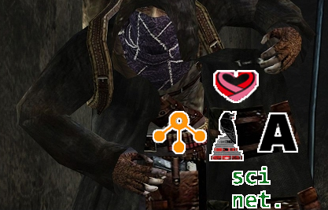
<figcaption>Figure 1. "Got something that might interest ya!" - Quote from the first time you meet The Buhonero's (Merchant) in the videogame Resident Evil 4. The Buhonero sells weapons. </figcaption>

In this post, I [yap](https://dictionary.cambridge.org/dictionary/english/yap) about the platforms and tools that have been (and are still) used to access articles and books _unconventionally_ and for free (as of May 2025).

More specifically, I will describe how to use:

- Sci-Hub
- Nexus Project
- Wosonhj / SmartQuantAi
- Sci-Net
- Anna's Archive

This list is somewhat arranged in order, from "easiest platform to use" to "you need to read a little bit to properly use this".

### Disclaimer

Needless to say, this text is for educational and research purposes only, similar to the many articles discussing this topic in prestigious journals such as [Nature](https://www.nature.com/articles/nature.2016.19841), [Science](https://www.science.org/doi/10.1126/science.aaf9419), [Lancet](https://www.thelancet.com/journals/langlo/article/PIIS2214-109X(16)30188-7/fulltext), and many more.

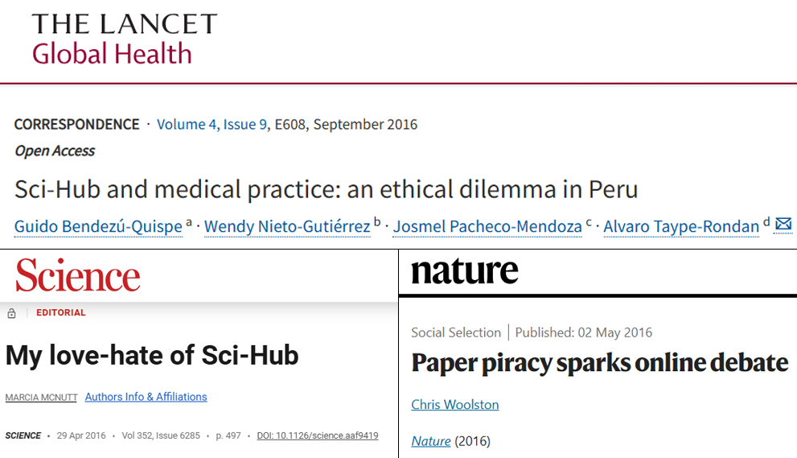
<figcaption>Figure 2. References I make in the text, because God knows you probably won't click them. Note that most of them are from 2016.</figcaption>

So, you are here because you need to access an article, or maybe a book. 

These are your options:

## Sci-Hub

### DOI Search

Launched in 2011 by Alexandra Elbakyan, Sci-Hub is the most-well known website for the purpose of accessing paywalled academic articles. It is no secret that this platform has been fundamental to the research process for thousands (perhaps millions?) of researchers.

Who downloads pirated papers from Sci-Hub? 

Everyone, [and that's no exaggeration](https://www.science.org/doi/10.1126/science.352.6285.508).

Using Sci-Hub is straightforward. You access the website (you'll have to Google it, sorry) and in the search bar provide either:

- The full title of the article

OR

- The Digital Object Identifier (DOI) of the article

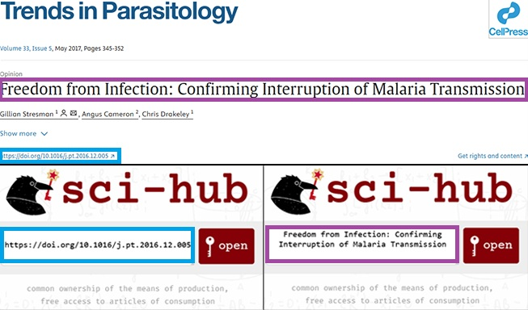
<figcaption>Figure 3. Example of how to search an article on Sci-hub using either the full title or the DOI. Image above shows the article name and DOI. Below, how to search for the article with both (through title or DOI)</figcaption>

Unfortunately Sci-Hub's collection has not been significantly updated since ~2022, meaning you won't find much post-2022 literature there.

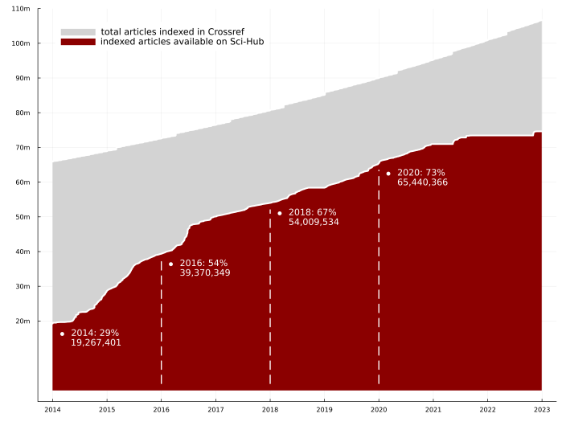
<figcaption>Figure 4. Articles available in Sci-Hub database vs. total number of articles according to Crossref index. Taken from Elbakyan, A. (2025). "From Black Open Access to Open Access of Color: Accepting the Diversity of Approaches towards Free Science"</figcaption>

For books, unless they have a DOI, you won't find them on Sci-Hub. For books you need to use LibGen and search with an International Standard Book Number (ISBN) code.

Finally, I strongly suggest always searching with the DOI of an article. 

If the title you wrote isn't an exact, word-by-word match, your search will fail.

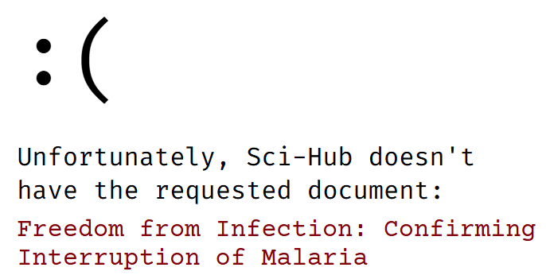
<figcaption>Figure 5. Failed search example on Sci-Hub. I removed some words from the title of this article on purpose. </figcaption>

## Nexus Project

If Sci-Hub doesn't have the article you are searching for, a great next option is the Nexus Project library, accessible through either Telegram or their STC / Libstcc website.

In short, Nexus is a [non-centralized (IPFS) database](https://github.com/nexus-stc/stc) that aggregates from Z-Library, LibGen, millions of user-uploaded papers, and Sci-Hub itself. Similarly, you can search by article title (not recommended) or article DOI (recommended).

The platform can be accessed by different means, but I will focus on the two (2) most accessible for an average user (Telegram and Website). 

### Telegram Bots

On Telegram, you begin by chatting with a Nexus Bot.

The accounts and name of these bots are constantly changing, but searching for "Nexus Bot" or "Nexus Paper" in the Telegram search bar should do the trick.

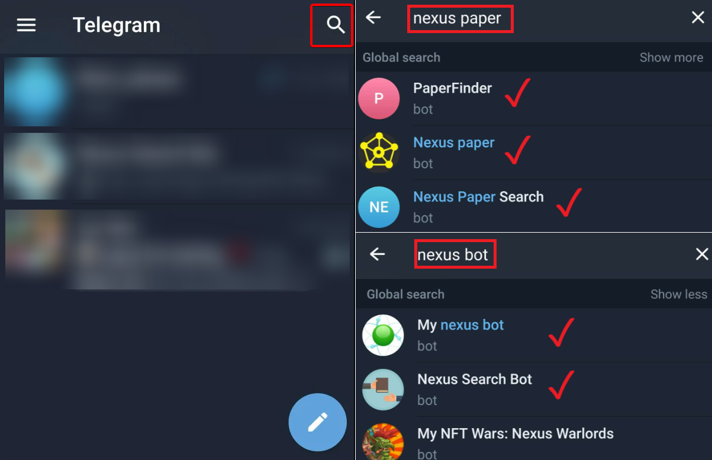
<figcaption>Figure 6. Searching and finding working Nexus bots in Telegram. At the time of writing, all of them worked. I did not try with the NFT bot, because it was beyond the scope of this post. </figcaption>

Once you start a chat, you search for the article and download it if it's available. 

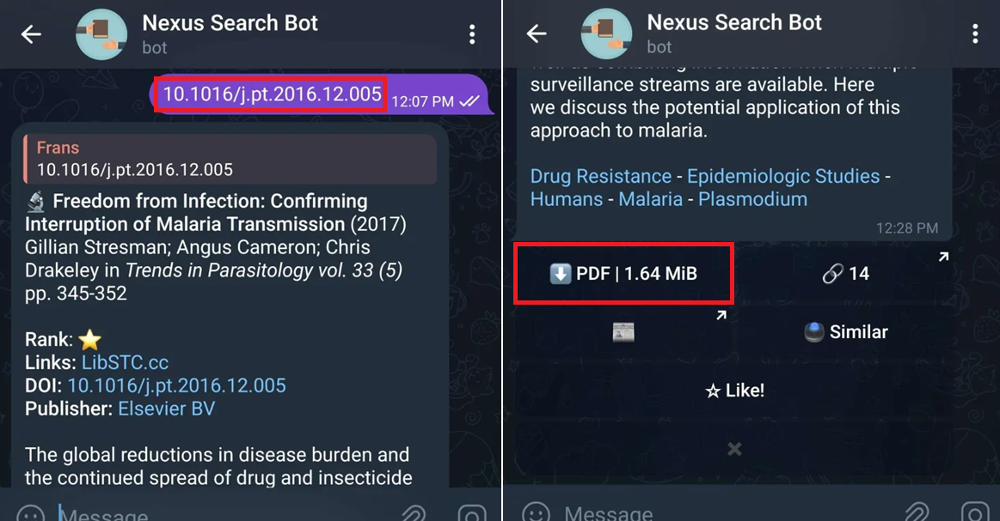
<figcaption>Figure 7. Once again, I strongly suggest always searching by DOI. Unlike Sci-Hub, searching with a partial title here will work, but the results won't be good.</figcaption>

If the article is NOT available, you will see a request button. Clicking adds a 1-point reward for the article, claimable by whoever uploads it first.

Once an user provides the article, you’ll be notified, and the article will stay in the Nexus Library for everyone else to search and download in the future.

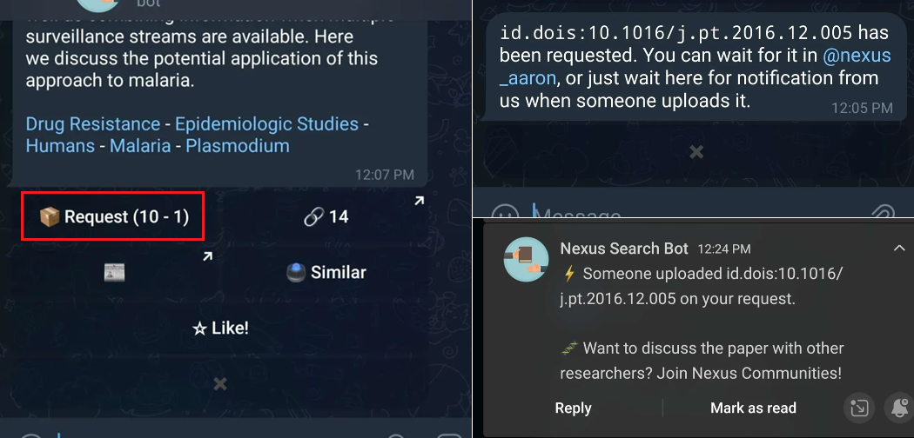
<figcaption>Figure 8. Left, button to make an article request. Top right, the bot confirms the request has been successful. Bottom right, notification confirming someone has uploaded the article I requested.</figcaption>

### Nexus Points

Points are the internal currency within Nexus to encourage users to upload articles. The more points an article's reward is worth, the more likely it is for it to be uploaded by another user.

You start with 10 points. These are replenished daily. With them you can either:

- Request ten (10) articles and offer 1 point for each

OR

- Make one (1) request and offer 10 points for it.

Finally, if you need more points, you can always upload articles others have requested. You can check the list of requested articles in the _request channel_.

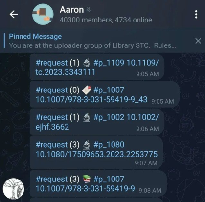
<figcaption>Figure 9. Telegram channel containing the pool of requests made by users.</figcaption>

### STC Website

If you don't have Telegram (and refuse to use it), you can still access the Nexus Database through their STC/Libstcc website.

You can search for an article with their DOI, and if you see a globe emoji next to the result, it means the article is available.

[Here would go the image of the website, but at the time of writing it was down. The bot on Telegram works though!]

That said, I strongly recommend using the Telegram bots instead of the website.

## Wosonhj / SmartQuantAi

If your article isn't on Sci-hub or Nexus databases, your best chance at obtaining the article you need is Wosonhj (also known as Smartquantai), which unlike previous alternatives, it works entirely as a forum.

Here, you always make a public request for an article in exchange for points. You get these points by:

- Creating an account: 50 points 
- Logging in daily: 20 points / day
- Completing requests of other users

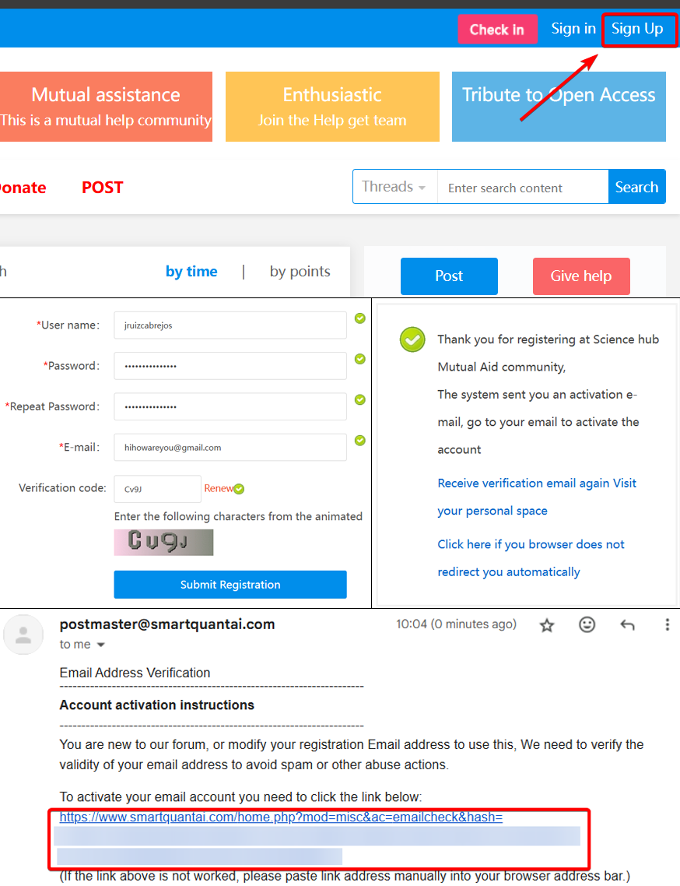
<figcaption> Figure 10. Account creation process for Wosonhj / SmartQuantAi </figcaption>

Requesting an article typically costs (a minimum of) 10 points.

More often than not, in my experience, a good Samaritan will share the PDF file within minutes (or seconds!) of making a request.

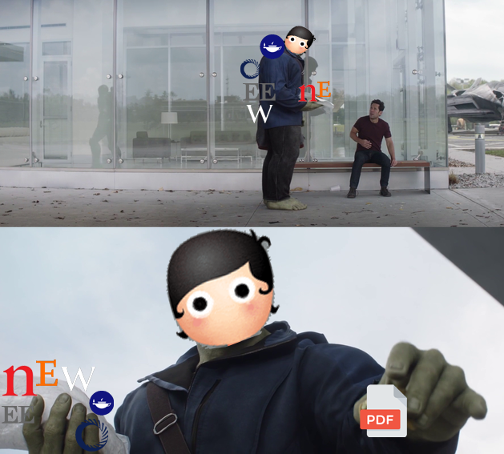
<figcaption> Figure 11. User from Wosonhj / SmartQuantAi shares a pdf with someone that does not have access to a paywalled scientific article. </figcaption>

### Forum Request

After creating an account, you request an article following this steps:

- Click "Post"
- Enter the DOI
- Click "Quick Check"

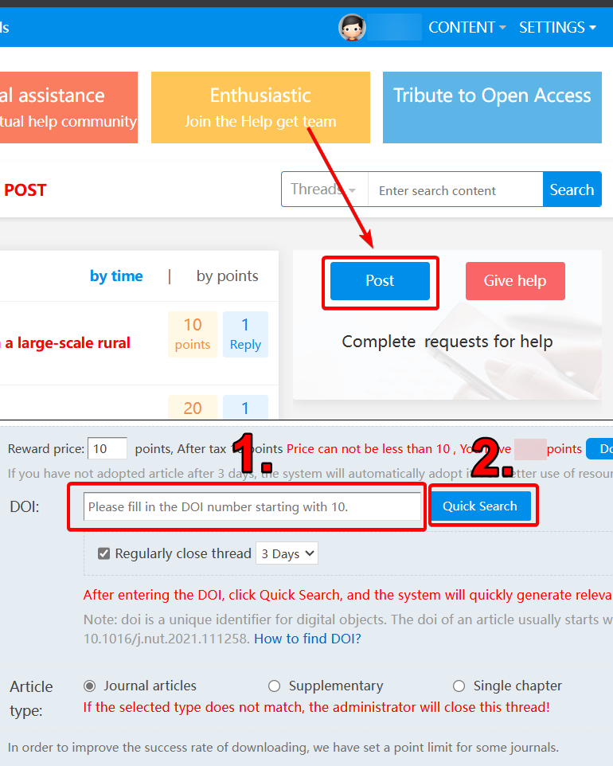
<figcaption> Figure 12. Article request process for Wosonhj / SmartQuantAi </figcaption>

Now, one of two things will happen:

- Your request is automatically filled. 

OR

- You have to manually type-in your request, at the very least, with this information:
    - Article Title
    - Link to the article

If you wish, you can also increase the reward to encourage a faster response.

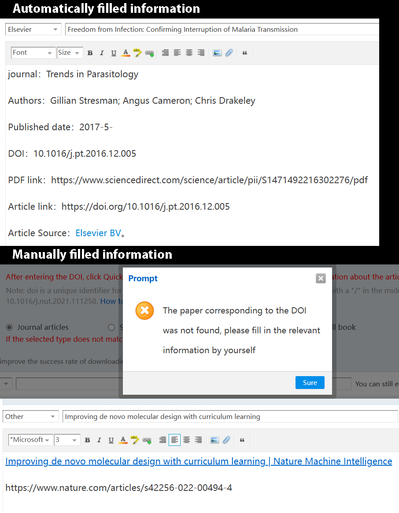
<figcaption> Figure 13. Example of information needed to request an article in Wosonhj / SmartQuantAi</figcaption>

Once your request is fulfilled and you have verified the contents of the pdf file, you must "Adopt" (accept) the file.

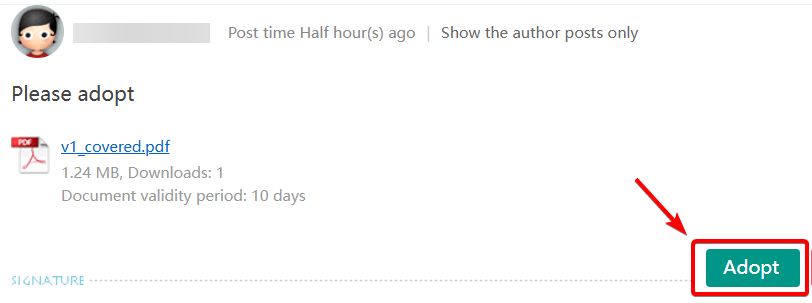
<figcaption> Figure 14. Do NOT forget to "adopt" your article. </figcaption>

Unlike other platforms, in here only you (the one requesting the file) will be able to download it. And after 10 days, the file is deleted from the website.

## Sci-net

The newest platform on this list is Sci-Net, launched while I was writing this post.

Think of it as a Sci-Hub 2.0.

It's created by the same person, and it uses cryptocurrency (Sci-Hub coin) as a point system similar to Nexus/Wosonhj.

The site is invitation-only. Now, in order to obtain an invite code and access, you must obtain Sci-Hub tokens first.

### Sci-Hub Tokens

If you have reached this part, unfortunately this section is incomplete.

The steps you should follow to get an invite code for Sci-Net are on their website (and yes, it is easy to Google).

Basically, you have to:

- Install Solflare Wallet on a mobile phone. This application is used to store, send and exchange Crypto tokens

- Next, you buy SOL tokens on your Solflare Wallet (the minimum purchase required is worth ~7 euros/~8 dollars at the time of writing)

- Convert your SOL tokens into Sci-Hub tokens

- Finally, with Sci-Hub tokens on your wallet, you scan a QR and obtain your Invite Code.

Important: Within the Solflare Wallet, there are 3 options of "sci-hub" tokens. 

The one you are looking for is the FIRST one on the following image.

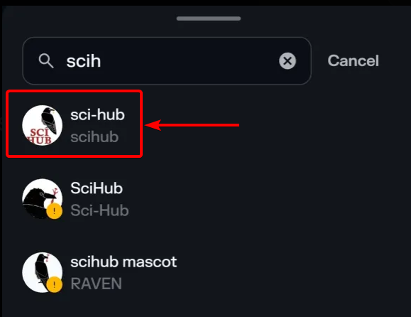
<figcaption> Figure 15. Sci-Hub token. </figcaption>

## Advanced Text Search

### Anna's Archive

If you are looking for a broader range of texts (books, comics, magazines, newspapers, etc), Anna's Archive should be your next stop.

[Main image for anna's archive]

Anna’s Archive allows keyword and partial title searches, returning a list of matching results.

[Search example]

The platform also has search filters and other search options which makes it handy for text-heavy queries. 

## Nothing worked, what do?

If none if the options above are appealing to you (or somehow they didn't work) you can always ask the Corresponding Author of the article either directly through email, or by sending a Direct Message (DM) to the author(s) through ResearchGate or LinkedIn.

Finally, I encourage you to pay for the article if you really want to :)

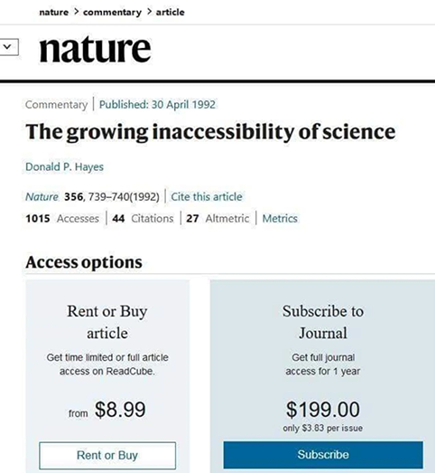
<figcaption>Figure 16. This meme is satire and the article is, in fact, free for access. Nevertheless, this meme has been shared everywhere and has been widespread on the internet for some years now.</figcaption>

## Colorful Open Access

All the platforms above are often labeled as in the literature as "Shadow Libraries" or examples of "Black Open Access". 

I avoid using those terms because they stigmatize and marginalize them into the realm of the "obscure". Moreover, it is a generalization of what ultimately is a wide variety of approaches to handle and workaround the growing inaccessibility of science.

Elbakyan A (2025) calls for a more vibrant and encompassing definition: A colorful open access framework. Because even black has many shades of grey.

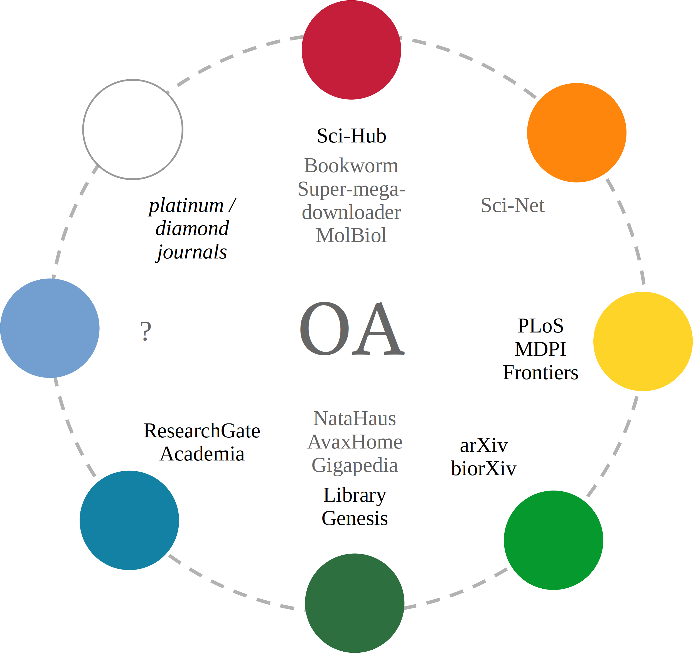
<figcaption>Figure 17. Graphical abstract of Elbakyan, A. (2025) paper "From Black Open Access to Open Access of Color: Accepting the Diversity of Approaches towards Free Science".</figcaption>

## Footnote

Limewire was (and now is again?), a peer-to-peer file-sharing platform, mainly used for music. 

The risk with these platforms is that bad actors could upload malicious files. For example, by inserting hyperlinks leading to pishing websites or other threats.

<figcaption>Figure 18. Your files could be laced with virus.</figcaption>

Being a pirate is fun, but it does come with risks.

Be careful out there not to click or download files called "not-a-virus.exe".

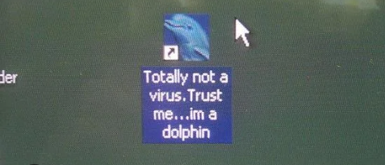
<figcaption>Figure 19. A dolphin file you can fully trust with your most sensitive files.</figcaption>

[Image dolphin not a virus]



