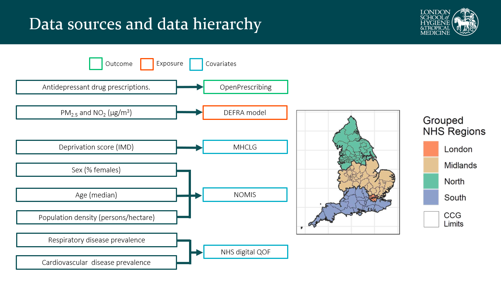
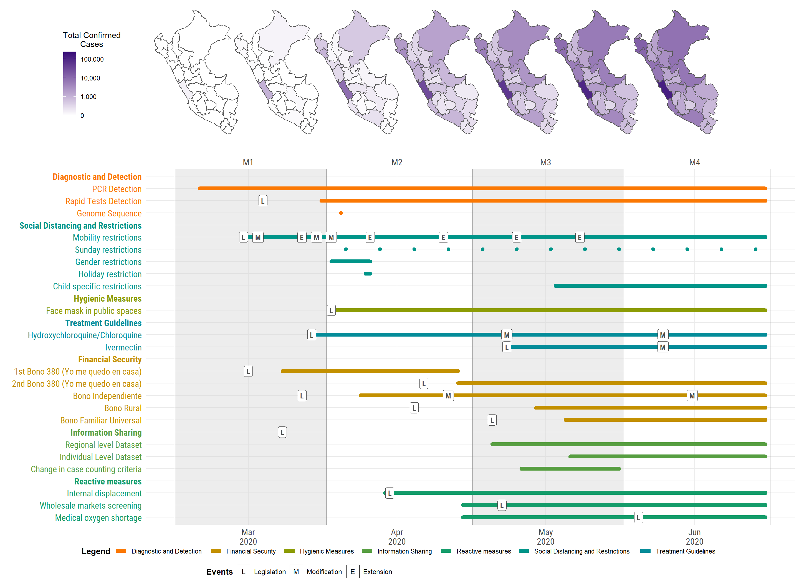
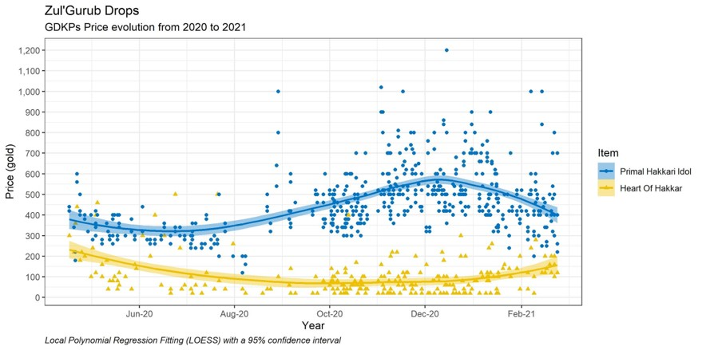

---
authors:
- admin
date: "2024-12-09"
image:
  caption: 'La fábula (El Greco): [**El Prado Museum**](https://www.museodelprado.es/aprende/enciclopedia/voz/fabula-una-el-greco/2ffa1a48-8d05-4291-a9eb-d0f5e51e6081)'
summary: 'This “personal” website has been changed and rebuild several times over the past few years. Hopefully this is the last one?'
tags:
- Me
- Viz
title: "Hello World, I guess"
---

### print("Hello World")

At the time of writing, my web(site) starts with an ominous message: 

{}
"This “personal” website has been changed and rebuild several times over the past few years. Hopefully this is the last one?" 
{}
 
And while I do hope this is the last time I am rebuilding this website, I have to recognize that I suffer from a 'lack of documentation' problem. Don't get me wrong though: 

Everything I have done in the context of "academic" projects has been meticulously documented and every step is detailed somewhere. Where and when possible, papers and methods are publicly available and are open-source. If you don't know what the [FAIR Principles](https://www.nature.com/articles/sdata201618) are, don't talk to me, etc. 

I also have the tendency to hoard and take note of every little idea, draft or file that was generated through the ✨process✨just in case we have to 'look back at it'  in the future.

I am also a big fan of using diagrams to describe stuff in general.

***Figure 1.** Slide for the course 'Data Challenge', as part of my MSc programme. Map on the right is my own. Diagram on the left probably not.*

My documentation problem comes down to my "personal"("pet"?) projects. Over the years I have written code for several tools to process, scrap, or extract data. I have generated data visualizations (most terrible, some great) that are located *somewhere* in the many virtual files I possess, but none of it has been publicly posted anywhere.

Some fragments of code lost to time are not impressive (or at least I would not call them as such), but I always think of them whenever I am asked for examples of previous work I have done. 

***Figure 2.** Evolution of the different public health measures and policies taken during the COVID-19 pandemic in Perú, Mar-Jun 2020. Made by me.*

Have I done Shiny apps? Yes. Do I have a Shiny app I can share with the class? No :(. 

The ✨data collection process✨ to extract *price data* from  unstructured texts, tables and images inside Discord chat servers for a videogame community in World of Warcraft: Classic took me about a dozen hours to polish. 

All I have to show for it is a very simple graphic which I actually really like (the graphic does tell a story, for those who are a bit more familiar with its contents), but in retrospective it falls short when trying to explain the technical aspects behind the data collected.

Can I process unstructured chat data containing multiple types of data? Yeah. Can I explain to you how I did it? 

Uh, kind of?

***Figure 3.** Price of bids (won) for two items in World of Warcraft: Classic GDKPs*

This website is one of those "personal projects" that at some point existed, got abandoned, and had to be rebuild, over and over, due to a lack of maintenance.

I took the jruizcabrejos 'nickname' around 2015, and bought the .com domain at some point in 2018, shortly after having the talk with my supervisor about which 'scholar/academic' name should I choose for my (first) publication(s). 

It is almost like choosing an appropriate username for a MMORPG videogame. Would you rather be known as the lvl 50 Warrior named as 'Save'? (one word, simple, elegant) Or as the lvl 50 Warrior known as 'XxAnimeManga01xX'? (many words, unhinged, based).

In my case, "Jorge Ruiz" is fairly common and I would like to keep my mother surname, so I ended up using "Jorge Ruiz-Cabrejos" or jruizcabrejos / J. Ruiz-Cabrejos for most things.  
### Actually, it is "Hello, World!"

These posts are a good excuse for me to document my personal projects and publish somewhere all the "waste code" that I generate along the way, starting with this website. 

Finding the figures above (Fig.1, Fig.2 and Fig.3) took me longer than what I actually used to write this post. So I guess it is more of an ’indexing’ problem and not so much a ’lack of documentation’ what I have.  

***Figure 4.** "If you see me one day uploading to my tiktok a blog of my day-to-day and saying stuff no one asked with 2 likes, 10 views and 0 comments, leave me alone. I am exactly where I want to be" from @desorden-memetico*

### References

Really helpful resources I used while building this website (and that I am 100% sure I will find myself looking back at them) are:

- https://connorrothschild.github.io/v4/post/animate-hugo-academic
- https://matteocourthoud.github.io/post/website/
- https://www.dsquintana.blog/create-an-academic-website-free-easy-2020/
- https://nickballou.com/blog/custom-wowchemy/#
- https://www.emilyzabor.com/tutorials/rmarkdown_websites_tutorial.html

Some personal websites I looked at for inspiration:

- https://theo.io/
- https://nickballou.com/
- https://matteocourthoud.github.io/
- https://djnavarro.net/

The "[...],I guess" in the title is a reference to this [amazing video from bill wurtz](https://www.youtube.com/watch?v=xuCn8ux2gbs):



