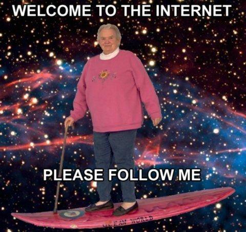
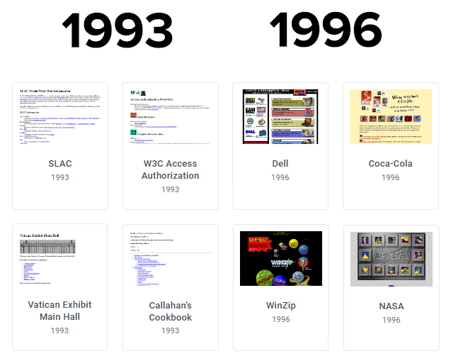
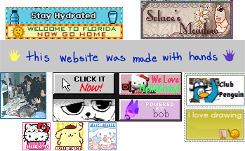
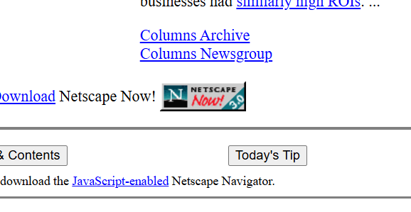
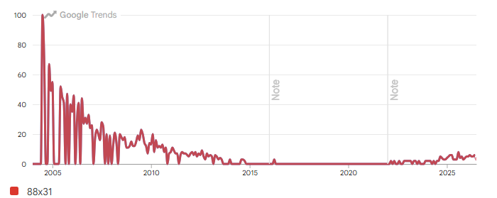
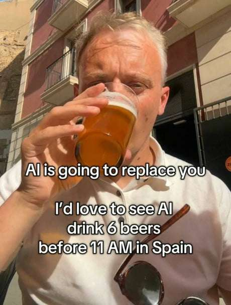
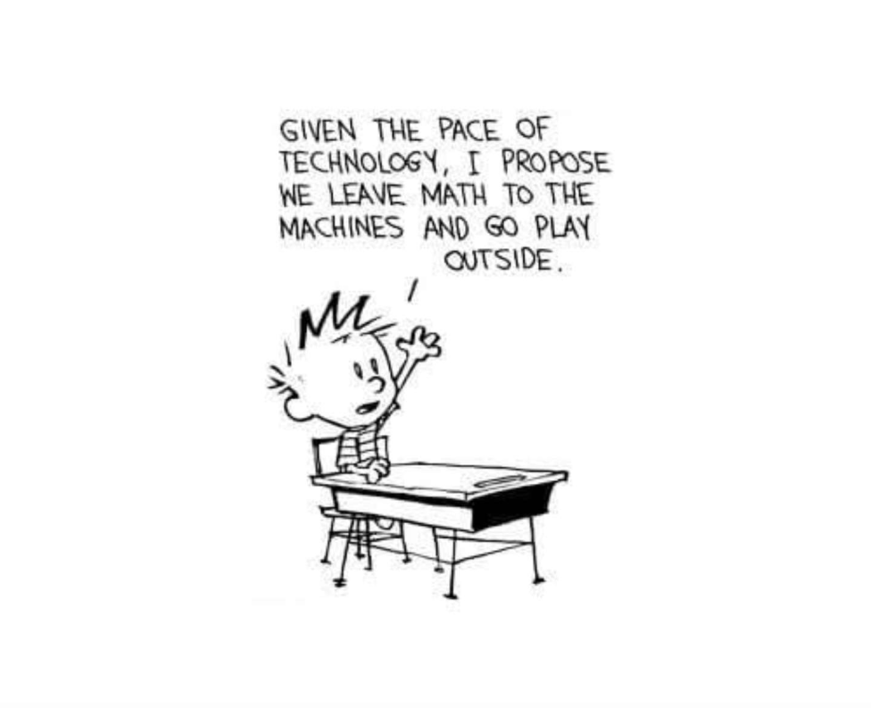
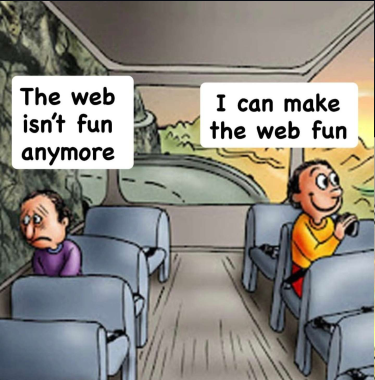
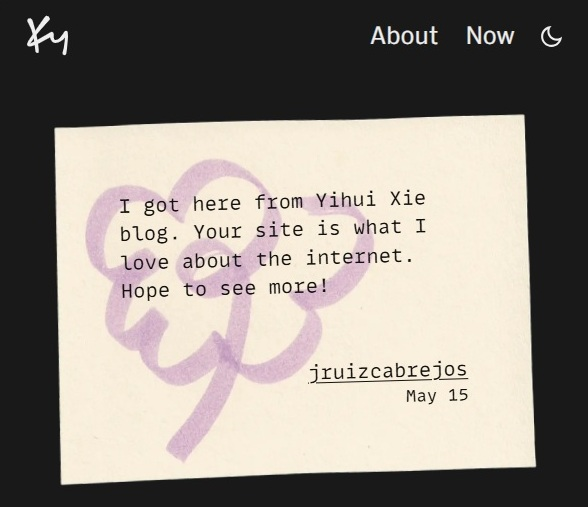

---
authors:
- admin
date: "2026-08-01"
image:
  caption: 'A collection of 88x31 buttons.'
summary: 'Perfection is the enemy of the good, and the good is the enemy of the slop. 88x31 buttons and  reflections on AI-assisted coding.'
tags:
- Pet project
title: "Humor as a Service (HaaS)"
---

This story begins with me, once again, completely lost in the _World Wide Web_, ["surfing the internet"](https://web.archive.org/web/20170227142216/http://www.netmom.com/images/stories/file/surfing_the_internet/Surfing_the_Internet%202_02.pdf) . An experience that, I am afraid, is becoming increasingly rare in a centralized web shaped by algorithms , with only a few comparable activities still thriving today, such as [getting lost in Wikipedia rabbit hole](https://en.wikipedia.org/wiki/Wiki_rabbit_hole).

<figure>

<figcaption>Figure 1. "Welcome to The Internet" is a catchphrase commonly accompanied by a very extravagant, and often somewhat unhinged, image of what people imagine the Internet to be. <a href="https://knowyourmeme.com/memes/welcome-to-the-internet" target="_blank" rel="noopener noreferrer">I think</a>.</figcaption>
</figure>

I no longer remember what I was looking for, but somehow I ended up at Yihui Xie's [personal website](https://yihui.org/), where I read his [personal thoughts on AI-assisted programming](https://yihui.org/en/2026/05/ai-reflections/).

[_Addiction_](https://yihui.org/en/2026/05/ai-reflections/#addiction) aside, in his post, he described feelings I have become all too familiar with, after having myself gone through the experience of building my first [slop-driven app](https://www.linkedin.com/posts/jorge-ruiz-cabrejos-4a3230a1_el-candidato-electoral-ideal-para-estas-elecciones-ugcPost-7444428294684418048-cF4u/). 

In his post, two things caught my attention:

- A reference to a blog post written by Ky Decker, where he questions whether he [belongs in "tech" anymore](https://ky.fyi/posts/ai-burnout).
- The idea of HaaS (Humor as a Service).

This post of mine is the result of exploring these two points.

### 88x31 buttons

The 1990s Internet saw the [rise of browser-based web navigation](https://michal.karzynski.pl/blog/2010/10/10/browser-usage-statistics-past-present-and-future/) we know of today, thanks to [developments](https://www.w3.org/People/Berners-Lee/FAQ.html#browser) that made it possible, and much easier, to display color, and eventually, in-line images.

Before the popularization and widespread adoption of browsers like Mosaic (1993-1997) and Netscape (1994-2008), most websites were made purely out of text.

<figure>

<figcaption>Figure 2. Websites before and after browser navigation. Images taken from the <a href="https://www.webdesignmuseum.org/gallery" target="_blank" rel="noopener noreferrer">Web Design Museum</a></figcaption>
</figure>

At this point in time, Google (1998-present) had not yet achieved absolute hegemony yet ([and web crawlers still had lots of room for improvement](https://scispace.com/pdf/a-brief-history-of-web-crawlers-30xottljtr.pdf)), so in order to discover new pages, it was common for websites to have multiple related hyperlinks so visitors could jump, and connect, between them. 

Access to colors and images within browsers during the mid-90's led to an [explosion of web design and personal expression](https://www.webdesignmuseum.org/gallery). Importantly, it meant that text hyperlinks could now be served as highly personalized "visual buttons".

<figure>

<figcaption>Figure 3. Buttons(?) of different sizes and from different websites. These were freshly taken from: Solcae's Meadow: <a href="https://kawaiiattic.arunyi.art/#sites" target="_blank" rel="noopener noreferrer">https://kawaiiattic.arunyi.art/#sites</a> ;
The Snail Garden: <a href="https://thesnailgarden.nekoweb.org/" target="_blank" rel="noopener noreferrer">https://thesnailgarden.nekoweb.org/</a> ;
TGE Peru <a href="https://tegperu.org/tegperu/default.jsp?target=/sp_intro.jsp" target="_blank" rel="noopener noreferrer">https://tegperu.org/tegperu/default.jsp?target=/sp_intro.jsp</a> ;
Ky Decker: <a href="https://ky.fyi/webrings#badges" target="_blank" rel="noopener noreferrer">https://ky.fyi/webrings#badges</a> ;
Kkul Store: <a href="https://kkul.store/" target="_blank" rel="noopener noreferrer">https://kkul.store/</a>
</figcaption>
</figure>

Among these, the 88px wide by 31px high button standard (88x31) is one of the [most enduring formats](https://support.google.com/admanager/answer/1100453?hl=en#other).

Its origin story on how it came to be seems somewhat unclear. Trying to understand it has already taken some hours of my life, and there might be a lot more to document about it. 
Nevertheless, the most widely known 88x31 button  at some point became the "Netscape button".

<figure>

<figcaption>Figure 4. Netscape. Now. Circa 1996. Available at: <a href="https://web.archive.org/web/19961020015116/http://www3.netscape.com/" target="_blank" rel="noopener noreferrer">https://web.archive.org/web/19961020015116/http://www3.netscape.com/</a> If you think about it, the "NOW" sounds a bit aggressive.</figcaption>
</figure>

The design of many buttons from this era share the same features:

- Background: Grey (Hex: `#C0C0C0`)
- Border: 2px wide with a 'bevel-edge 3D effect'
- Size: 88x31 pixels

Optionally, it could have logos, some text, and/or [epilepsy-inducing](https://en.wikipedia.org/wiki/Denn%C5%8D_Senshi_Porygon) flashing effects & colors.

<figure>

<figcaption>Figure 5. Example of what the unchanging, perfect, and eternal abstract idea of a 88x31 button is.</figcaption>
</figure>

The popularity of the 88x31 button peaked and faded. With the rise of the web 2.0, it gradually vanished alongside GeoCities (1994-2009), a now defunct free service to host personal websites.

But now, after a decade in disuse, the 88x31 buttons seem to be having a [resurgence](https://newpublic.substack.com/p/the-handmade-internet-is-making-a), fueled by [Neocities](https://neocities.org/) (2013-present), the spiritual successor to GeoCities.

<figure>

<figcaption>Figure 6. I dislike having to use Google Trends, but it somewhat gets the point across, and I feel like this post needs some data. Somewhere.</figcaption>
</figure>

When I first visited Ky Decker's website, at first I thought to myself: 

> This is a cool website, and I hope I can have something like this one day
{.thought-quote}

Then, I saw his [button collection](https://ky.fyi/webrings). 

It was an aesthetic I hadn't seen in many years. I recognized it. It felt oddly nostalgic. And yet, I had either completely forgotten about it, or perhaps I never experienced it in the first place. Until now.

> My personal website definitely needs some buttons
{.thought-quote}

And with that, I began my search for the tools to do so.
 
### Perfection is the enemy of the good, and the good is the enemy of the slop

I like to think that I am resisting the adoption of AI the best I can. However, I have to admit that at some point between 2025 and 2026, the LLM chat assistants started to outperform me in some coding aspects.

"[You can't choose when it hits you](https://www.instagram.com/p/DMTcKewyjwL)", and one day, frustrated with [ggplot2](https://ggplot2.tidyverse.org/), for the first time since 2022, it hit me. The _big machine_ was finally able to give me a workaround for a piece of code I had spent hours struggling with that made me say:

> _~holy shit AI might actually take my job~_  oh, ok, that is cool.
{.thought-quote}

<figure>

<figcaption>Figure 7. The original source of this meme might be lost to time.</figcaption>
</figure>

Right now (2026), I still wouldn't use LLM's for writing. I still want to feel [whatever this is](https://www.instagram.com/p/DNWLkoTuw3h/). I also refuse to generate AI images, videos, or sounds. I don't let any AI or LLM touch the scripts I write for data analysis either.

But what about a minor bug in the 5-line function I wrote? What about the plot to visualize data that I have already pictured in my mind, and that I know how to code, but that I also know will take some time to get right?

<figure>

<figcaption>Figure 8. I initially shared this Calving and Hobbes vignette in my personal Facebook on April 14, 2018.</figcaption>
</figure>

Is there really a grey area? Is what I do "_code generated by AI_"? Or "_code assisted by AI_"? Where does technological aid stops and [intellectual deterioration begins](https://www.media.mit.edu/projects/your-brain-on-chatgpt/overview/)? And, does it make any meaningful difference? 

The writing here is all mine, as well as any idea I develop. Any further customization I code into this website, or any other code I work with, was also inspired by my own lived experiences, for now.

While searching for different 88x31 buttons (and the means to make them) it became clear that many out there building beautiful handmade [digital gardens](https://maggieappleton.com/garden-history) vehemently oppose any form of coding that involves AI.

Sam Altman once said that [AI might lead to the end of the world, but in the meantime we will have some great companies](https://www.forbes.com/councils/forbesbusinesscouncil/2026/02/25/why-sam-altmans-famous-quote-should-make-leaders-uneasy/) .
I want to think that AI won't totally destroy humanity, or the world. If anything, it might [destroy a good chunk environment](https://news.mit.edu/2025/explained-generative-ai-environmental-impact-0117). 

And in the meantime, at least we should get some fun out of it, I guess.

<figure>

<figcaption>Figure 9. Meme from internet culture writer <a href="https://www.phonetime.news/" target="_blank" rel="noopener noreferrer">Kristin Merrilees</a>.</figcaption>
</figure>

I want to contribute my own share of fun through Humor as a Service (HaaS).

Unlike "Chat LLMs“, which to me are glorified search engines that occasionally help me debug a line or two of code, "Agentic LLMs" seem to be equipped with extensive software development capabilities.

It is with the latter that, taking inspiration from several 88x31 button makers and generators out there, [I adapted my own](https://jruizcabrejos.com/buttonbuilder/) for my needs.

<iframe src="https://jruizcabrejos.com/buttonbuilder/" width="105%" height="500px" style="border:none;"></iframe>

### Colophon

How much fun is there in the universe?
Will we ever run out of fun?
Are we having fun yet?
Could we be having more fun?

[These are some interesting questions](https://www.lesswrong.com/s/d3WgHDBAPYYScp5Em/p/K4aGvLnHvYgX9pZHS) I would like to measure one day. 

<figure>

<figcaption>Figure 10. Meme from internet culture writer <a href="https://www.phonetime.news/" target="_blank" rel="noopener noreferrer">Kristin Merrilees</a>.</figcaption>
</figure>

I already have a ["Hello World" page](https://jruizcabrejos.com/post/hello-world-i-guess-20241209/), explaining how this website came to be. Maybe I need a "Colophon" page now, for me to detail how and where AI is used by me, if ever.

### Further reading

Nowadays you don't even have to go down the Wikipedia rabbit hole yourself. You can follow [someone who does it for you](https://en.wikipedia.org/wiki/Depths_of_Wikipedia).

- Beyond the Scroll: How Social Media Algorithms Shape Your Reality: https://towardsdatascience.com/beyond-the-scroll-how-social-media-algorithms-shape-your-reality/
- "The right-time web": https://journals.sagepub.com/doi/10.1177/1461444820913560
- Netmom Jean Armour Polly personal website: https://www.netmom.com/surfing/birth-of-a-metaphor

### Footnote

I began writing this blog entry on May 15th, 2026. 

By coincidence, I finally finished and published it on August 1st, 2026, the [day of the World Wide Web](https://www.daysoftheyear.com/days/world-wide-web-day/).

<figure>

<figcaption>Figure 11. The message I left in Ky Decker's Guestbook on May 15th, 2026  .</figcaption>
</figure>


