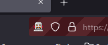
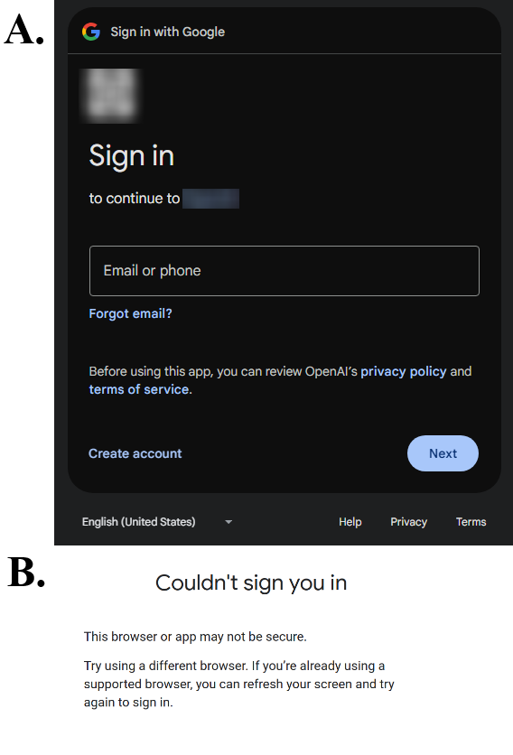
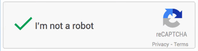
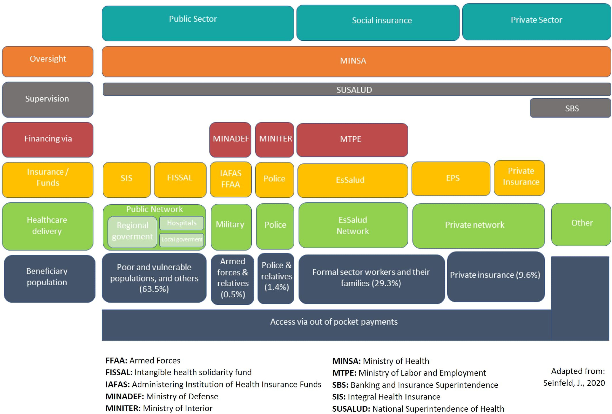
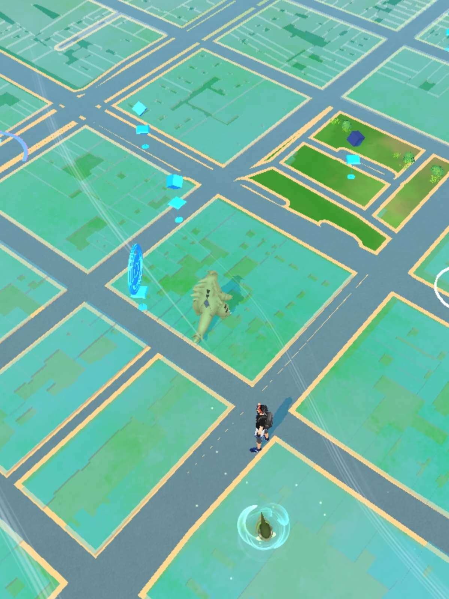
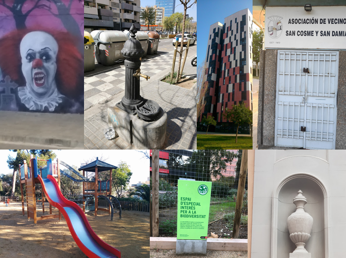
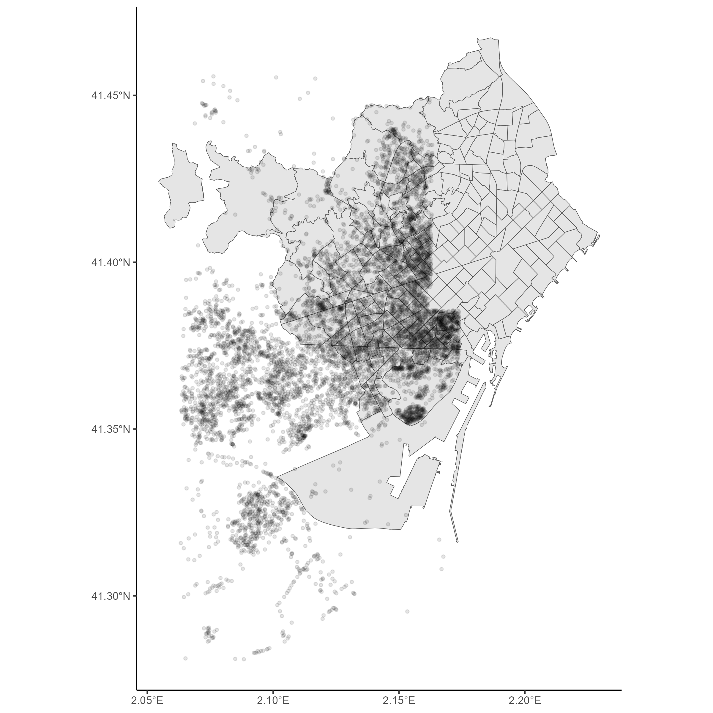

---
authors:
- admin
date: "2024-12-15"
image:
  caption: 'Grafiti Los conejos traviesos (Coords: 41.358247, 2.069731): [**Taken from Niantic Lab games**](https://www.google.com/maps/@41.358247,2.069731,21z)'
summary: 'Street art from a game rated E for everyone. Data scrapping with RSelenium, data preseveration, art curation.'
tags:
- Me
- Viz
title: "If it is art, it is fair use"
---

### Prelude

A week ago, if you had asked me what I'd be writing about, "art" wouldn't be on my list.

If anything, I would have guessed I would be writing about my electricity bill (which I downloaded hour-by-hour as a csv from [ENDESA website](https://www.endesa.com/es/te-ayudamos/sobre-tu-factura/ver-factura)), or maybe vent about [*undefined* geopolitical areas](https://en.wikipedia.org/wiki/List_of_territorial_disputes) and how they can cause issues when plotting them on a map.

But before I start talking about art, graffiti, and by-passing Google Authentication as a "robot", there is something else I want to mention first:

<figcaption>Figure 1. Favicon for this website. Self-made. </figcaption>

My favicon (that little icon you see on your browser) for this website was inspired by the workshop [ART FROM CODE from Danielle Navarro](https://art-from-code.netlify.app/), a course on computer-generated artwork using R which has its entire course material [posted online](https://github.com/rstudio-conf-2022/art-from-code). 

Mind you, what I produced is the result of 10 minutes of work and reading. Which is nothing compared to the 10+ hours the entire course is supposed to take.

I expect to come back and iterate on this icon (favicon) in the future, which is why I have made a [Github Repo](https://github.com/jruizcabrejos/website_icon) to track its change. 

### Data scrapping

A lot of the work I have been doing lately as part of my doctoral studies involves downloading and processing data from a vast selection of (mostly publicly available) sources. 

This can be as simple as clicking one or two buttons to download the dataset containing all the variables I want, or it can involve clicking 1,600 times for each combination of year, location, and variable I am looking for. Needless to say, I usually don't do that myself and instead I set-up a script to automate the process for me.

Since I primarily use "R", I rely on RSelenium to do my bidding, which is the R implementation of [Selenium, an open source umbrella project for a range of tools and libraries aimed at supporting browser automation](https://www.selenium.dev/) and more often than not, used for 'web scrapping'.

Whenever you open a browser using RSelenium, your browser will be labeled as a "robot" browser.


<figcaption>Figure 2. Robot browser indication in Firefox while using RSelenium for automated scraping tasks.</figcaption>

This can sometimes be an *issue*. Since a "robot" browser doesn't<sup>(and maybe should not?)</sup>have  the same permissions as organic users, websites may block it.

*("organic" as in, non-automated.)*

For example. if a website requires an user to log in using a Google Account, the website won't let you do this from a "robot" browser. "Robots" do not have Google accounts after all.


<figcaption>Figure 3. What if you wanted data, but God said "Please log in using your Google Account". <br> A) Google Account Sign In pop-up <br>B) Error message when logging from a "robot" browser.</figcaption>

If for some reason you needed to workaround this limitation, you could do so by creating a `profile` in your ("non-robotic") browser, and logging to your desired website with your Google Account while your `profile` is enabled.

By doing this, you make your `profile` 'remember you' (and your credentials), and the next time you use your `profile` from other devices or browsers, it will 'remember you' and not ask for credentials again.

We can pass this `profile` as an argument for the function `rsDriver()` when initiating your "robot" browser with Rselenium.

```r
# Setup profile to bypass Google Auth

## Enter 'about:profiles' on your browser to find your profile path.
## Replace USERNAME and xxxxxxxx with your data.
profile_path  <- "C:\\Users\\USERNAME\\AppData\\Roaming\\Mozilla\\Firefox\\Profiles\\xxxxxxxx.default-release"

# Setup profile config

firefox_profile <- list(
  `moz:firefoxOptions` = list(
    args = list("--profile", profile_path)
  )
)

# Start RSelenium Driver

## The extraCapabilities argument is what sets the profile up.
## Everything else are arguments I personally need to be able to run my own RSelenium.
## i.e. What argument you use might change depending on your own computer requirements.

rD <- rsDriver(port= sample(7600)[1], browser=c("firefox"),
               chromever = NULL,
               check = F,
               extraCapabilities = firefox_profile, 
               verbose = FALSE
)

remDr <- rD$client
```

And now this "robot" could in theory use your ID and be able to impersonate you with your Google Account.


<figcaption>Figure 4. You are not a robot.</figcaption>

I don't know why would someone need this, but might prove useful one day. Just make sure you always follow the websites terms of service. 

### Health data gaps

We live on a time of simultaneously having unprecedented amounts of data available, and yet somehow not enough data to answer some very serious (and urgent) questions. 

There is a 'gap' between the data that exists out there, and the data we can (really) use.

Sometimes this 'gap' is the result of systems not equipped to register the data. They simply lack the capacity to do so.

An example of this are health systems and (their lack of) mortality data, which you can read more about in the comment published in BMJ ['A lack of quality statistics is hiding the real heatwave death toll'](https://www.bmj.com/content/385/bmj.q1052) by Shetty D. 

Dysfunctional systems are unable to register data, and if they do, it is incomplete or not accurate.


<figcaption>Figure 5. The peruvian health system, commonly referred as a fragmented and segmented system. From Carrillo-Larco, Rodrigo M. et al. 2022</figcaption>

In other cases, the 'gap' is the result of data that cannot be used because of individual privacy, ethical aspects  or legal issues. 

The data 'exists', but we cannot use it (and for good reason). 

The comment ['Who owns (or controls) health data?'](https://www.nature.com/articles/s41597-024-02982-1) published in Scientific Data by Kahn, S.D. describes the ongoing debate on who (should?) control secondary use of health data, as well as the issues surrounding its ownership, which has historically been controlled by institutions and is nowadays shifting towards individuals.  

One can overcome some of these 'gaps' by developing new methods of analysis and leverage what little *imperfect* data you might have. Continuing with the example of mortality data, the article published in Lancet Regional Health Europe  ['The effect of temporal data aggregation to assess the impact of changing temperatures in Europe: an epidemiological modelling study'](https://www.thelancet.com/journals/lanepe/article/PIIS2666-7762(23)00198-9/fulltext) by Ballester, J. does precisely that by demonstrating you can use weekly data, instead of daily data, to obtain similar estimations of heat and cold related mortality.

In other cases, you might be able to process the data yourself by giving structure to what is otherwise unstructured and disorganized information. An example of this is the article published in PLOS Global Public Health ['The World Health Organization’s Disease Outbreak News: A retrospective database'](https://journals.plos.org/globalpublichealth/article?id=10.1371/journal.pgph.0001083) by Carlson CJ., in which the authors developed an annotated database of the subjective and often inconsistent information the Word Health Organization publishes in their Disease Outbreak News (as bunch of .pdf files).

And while scraping data can help overcome some access hurdles, deeper systemic issues often limit the availability and usability of crucial data, particularly in public health, but in other fields as well.

### Gatekeeping data

I have been mostly talking about health data because that is what I work with most days.

But what about other types of 'public data' (or files) that some institutions hold within them, like art?

Maybe out of ignorance, maybe due to technical limitations, but a lot of times data is not made available by policy and by design. 

It is 'kept away' on purpose, or barriers are put in place to make it difficult to access its contents. The data might be obtainable, but it will be annoying to use.

{}
Urban dictionary top definition for "gatekeeping" is:<br>*"When someone takes it upon themselves to decide who does or does not have access or rights to a community or identity."</br>*
{}

By definition, [street art should be by (and for) the general public](https://journals.ap2.pt/index.php/sauc/article/view/15). But that isn't always the case.

### Art and data preservation

As someone who hoards data and is kept awake at night by [the decay of Google Search and the expanding Internet Rot](https://www.youtube.com/watch?v=vwVFzY8XqIo), I love to preserve data and files.

But is it ok to preserve that which was not meant or does not want to be preserved?

'Pokemon Go' is an "augmented reality" game you can play from your cellphone. The 'augmented' and 'reality' part of the game being that the game requires you to 'physically' move towards objectives located on a map. You are forced to interact with your environment. 


<figcaption>Figure 6. Pokemon Go User Interface - Player, pokemons, pokestops and a park can be seen, among the different buildings and roads that make up this virtual map.</figcaption>

'Ingress', a game of the same nature but probably less well known when compared to the Pokemon franchise, was one of the pioneers [(but not the first)](https://en.wikipedia.org/wiki/List_of_geolocation-based_video_games) to explore the concept of location-based games.  

For both of these games, the objectives or locations on a map are not points arbitrarily placed. They are called "points of interest" (POI's) and there is a [list of criteria](https://niantic.helpshift.com/hc/en/21-wayfarer/faq/2770-eligibility-criteria/) for what is considered a POI and what is not. 

Players submit proposals for new POI's, and the community votes and curates the proposals.

This database of POI's build by the community is hosted on the platform called 'Niantic Wayfarer' (in which the submission and voting process occur) and is owned by 'Niantic Labs', a company owned by 'Google', and producer of both 'Pokemon Go' and 'Ingress'.

Anything of cultural or artistic value falls under the category of "POI", graffiti included.


<figcaption>Figure 7. Small selection of POIs from Niantic Wayfarer. A graffiti, a water fountain, a building, a neighboors association, a kids park, a park, and a esculpture.</figcaption>

But graffiti were meant to be ephemeral, are they not?  

There is a lot that can be said (and discussed) about the graffiti use on these augmented reality games. 

What can these graffiti tell us about the community, the city, and how they build their (virtual) space? 

Would the authors of these POI's with graffiti in them be ok with their creations being made as public and as accessible as possible?

Who really own these? the artist who made it, the player who submitted it, the community that approved it, or the companies that 'gatekeep' the data?

I do not have any answers, only more questions. But I also have 8,000 POI's coordinates from Barcelona (and counting), which I plan to use to explore some of these questions. 


<figcaption>Figure 8. Distribution of POI's across Barcelona from the game 'Ingress'.</figcaption>

Art is theft, said Picasso, allegedly, not referring to the act of stealing itself but rather about stealing inspiration from previous artists (or something like that?).

Whether we're talking about scraping data for health research or preserving street art, the topics of accessibility, ethics, and ownership are present.

As long as it is art we are talking about, in my opinion, everything is fair game and fair use.

### References

- https://github.com/rstudio-conf-2022/art-from-code
- https://art-from-code.netlify.app/
- https://github.com/jruizcabrejos/website_icon

#### Footnote



Alternative footnote on robots is [here](https://www.youtube.com/watch?v=sqK-jh4TDXo).
