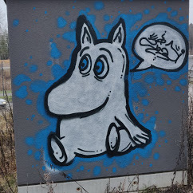

---
authors:
- admin
date: "2024-12-22"
image:
  caption: 'Illustration by  サクヤ (x.com/7UU61): [**From ノウナイディスコ / IA [CeVIO AI] - By r-906**](https://www.youtube.com/watch?v=NMiQmumW0nI)'
summary: 'Working with colors as data in R. Palettes, dominant color quantification and K-means.'
tags:
- Me
- Data
- Viz
title: "Playing with colors"
---

As a kid, whenever I had different colors of paint or colored modelling clay on my hands, I would inevitably end up mixing all of them in an attempt to make this imaginary "super" color.

The result would always end up being the same: An ugly grey-ish dark mud color—the kind you get from such a mix.


<figcaption>Figure 1. Attempt at recreating the mud-like color I remember as a kid. Done with R and ggplot.</figcaption>

I had no idea at the time (and realistically, I still probably don't) that there is a whole field dedicated to studying color theory and that the color I was getting is the result of subtractive color mixing. 

You mix *materials*, you get dark. You mix *light*, and you get white.

## Colors in R

In all of my introductory classes or lectures about R, one of the first documents my students are introduced to is the [2006 R colors cheat-sheet](https://www.stat.columbia.edu/~tzheng/files/Rcolor.pdf) by [Ying Wei](https://yingweistat.com/), which neatly displays the 657 available colors in R base (`colors()`) in *only* 7 pages.


For a more diverse selection of colors, palettes, and themes, there is a [Comprehensive list of color palettes in R](https://github.com/EmilHvitfeldt/r-color-palettes) by [Emil Hvitfeldt](https://github.com/EmilHvitfeldt), which  provides an extensive compilation of packages and resources for colors (in R).


<figcaption>Figure 2. Some of the R packages available in the comprehensive list.</figcaption>

Whenever I am able to, I try to make my own palette while playing with [Paletton](https://paletton.com/), a comprehensive color selection tool to pick your ideal color scheme. And when I inevitably fail on making an appealing color selection, I use palettes from some of these R packages:

- [MetBrewer](https://github.com/BlakeRMills/MetBrewer)
    - MET (Metropolitan Museum of Art in New York)

- [Scientific Journal and Sci-Fi](https://cran.r-project.org/web/packages/ggsci/vignettes/ggsci.html)
    - Lancet, BMJ, JAMA...
    
- [ThemePark](https://github.com/MatthewBJane/ThemePark)
    - Themes for Game of Thrones, Barbie, The Simpsons...

- [Innovar](https://github.com/healthinnovation/innovar)
    - Palette collection of the [Health Innovation Lab](https://github.com/healthinnovation)
    
- [HCL colors](https://colorspace.r-forge.r-project.org/reference/hcl_palettes.html)
    - Based on the HCL (hue-chroma-luminance) color model.

- [Ghibli](https://github.com/ewenme/ghibli)
    - Based on: Spirited Away (2001), Kiki's Delivery Service(1989)...
 
- [Wes Anderson](https://github.com/karthik/wesanderson)
    - Based on: Moonrise Kingdom (2012), The Life Aquatic with Steve Zissou (2004)...
   
The article on [Coloring for Colorblindness](https://davidmathlogic.com/colorblind) is also a solid resource I tend to use. Likewise, the interactive tool [ColorQuest](https://github.com/lucanelli/colorquest) from [Luca Nelli](https://journals.plos.org/plosone/article?id=10.1371/journal.pone.0290923) is also helpful. 

## Image color analysis in R

The go-to package for image manipulation is ImageMagick or simply known as magick, a free and open-source cross-platform software for image manipulation with commands.

A big advantage of magick is being able to read most types of image files with a single function (`image_read()`), with the alternative being to use `jpeg::readJPEG()` and `png::readPNG()` for .jpg and .png files respectively.

For illustration purposes, I'll read the image in both .jpg and .png formats using both methods.

```r
img_magick.jpg <- magick::image_read("./6_32_Muumipeikko.jpg") ## Magick JPG
img_magick.png <- magick::image_read("./6_32_Muumipeikko.png") ## Magick PNG

img_jpg <- jpeg::readJPEG("./6_32_Muumipeikko.jpg") ## JPG as array
img_png <- png::readPNG("./6_32_Muumipeikko.png") ## PNG as array
``` 


<figcaption>Figure 3. Moomin.</figcaption>

With magick you will notice you get an image alongside some metadata (e.g. width and height). With the other methods, you get an array of 4 values per pixel, corresponding to the sRGB values for that image.

For us to work with the magick file, we will need to first extract its data with `image_data()`, convert those values to numbers with `as.integer()` and finally divide by 255 (If you start countring from 0 to 255, you get 256 values, or what 8 bits are able to hold)

```r
img_magick.jpg_array <- as.integer(image_data(img_magick.jpg, 'rgb'))/255 ## Magick JPG as array
img_magick.png_array <- as.integer(image_data(img_magick.png, 'rgb'))/255 ## Magick PNG as array
```

Now that all our objects are arrays, we transform those arrays into a data.frame for analysis and quantification.

```r
## Function to transform our arrays into a 3 variable data.frame.
## i.e. 3 columns for the Red, Green and Blue bands.
rgb_from_array_to_df <- function(img){
  data.frame(R = as.vector(img[, , 1]),
             G = as.vector(img[, , 2]), 
             B = as.vector(img[, , 3]))
}
```

```r
## From now on you will notice that all four objects are essentially the same.
## With maybe some differences between jpg and png files.
img_magick.jpg_df <- rgb_from_array_to_df(img_magick.jpg_array)
img_magick.png_df <- rgb_from_array_to_df(img_magick.png_array)

img_jpg_df <- rgb_from_array_to_df(img_jpg)
img_png_df <- rgb_from_array_to_df(img_png)
```

The most common and basic form of analysis for images and colors (that I could find in a non-exhaustive Google Search) is applying a K-means clustering algorithm to find the most "dominant" colors in an image. 

In short, K-means is an unsupervised machine learning technique that groups similar colors based on their cluster centroids until convergence is reached (i.e., until the predefined number of clusters (K) is achieved).

Here I will go for 10 clusters using the function `clara()`. You will notice this works on all four examples of the same image.

```r
## Running clara() for all four to compare results later if needed.
## And to check that they are read the same by the 2 functions.
img_magick.jpg_clara <- cluster::clara(img_magick.jpg_df, k = 10)
img_magick.png_clara <- cluster::clara(img_magick.png_df, k = 10)

img_jpg_df_clara <- cluster::clara(img_jpg_df, k = 10)
img_png_df_clara <- cluster::clara(img_png_df, k = 10)
```


<figcaption>Figure 4. The 10 clustered colors extracted from the Moomin image.  <br>The vector `rgb(pmax(img_og_jpg.clara$medoids))` was used for this plot using ggplot.</figcaption>

There are a lot of colors coming from the grass and the sky, and while it is true all of it is part of the image as a whole, I am more interested in the (moomin) art itself.

Here we can leverage magick functions and crop our image.

```r
##Example using the object loaded as Magick PNG 
image_info <- image_info(img_magick.png)
square_size <- min(image_info$width, 
                   image_info$height)

# Calculate the coordinates for cropping from the center
x_offset <- (image_info$width - square_size) / 2
y_offset <- (image_info$height - square_size) / 2

# Crop the image to a square from the center
crop_img_magick.png <- image_crop(img_magick.png, 
                                  paste0(square_size, "x", square_size, 
                                         "+", x_offset, "+", y_offset))
```


<figcaption>Figure 5. Cropped Moomin.</figcaption>

The crop isn’t perfect; ideally, I’d remove some of the dry grass still visible on the left and right sides. If we wanted to refine this further, we could automate the cropping by training an AI model using Keras and TensorFlow.

But I will leave it like that for now. 

Now we re-run the analysis with k-means above for the cropped image, change our code a little bit, and compare results.

```r
## This is how the entire "pipeline" would look like.
## We start with an object of class `magick-image`.
crop_img_magick.png_array <- crop_img_magick.png %>% 
  image_data('rgb') %>% 
  as.integer(.)/255

crop_img_magick.png_clara <- rgb_from_array_to_df(crop_img_magick.png_array) %>%
  cluster::clara(k = 10) 

## We add our results to a dataframe for visualization.
crop_df <- data.frame(colors = rgb(pmax(crop_img_magick.png_clara$medoids)),
                      size = crop_img_magick.png_clara$clusinfo[,1]) %>% 
  arrange(desc(size))

crop_df$colors_factor <- factor(crop_df$colors,
                                crop_df$colors,
                                crop_df$colors)

```


<figcaption>Figure 6. Moomin Comparison.</figcaption>

The cropped image allows us to *capture* more of the blue colors within the image. Which should be a more accurate representation of what we are looking at.

Next we can use Principal Component Analysis (PCA) to convert our 3D points (R, G and B) into 2D values and visualize their distribution and variation.

```r
PCA_data <- rgb_from_array_to_df(crop_img_magick.png_array)

PCA <- prcomp(PCA_data[,c("R","G","B")], center=TRUE, scale=TRUE)
PCA_data$u = PCA$x[,1]
PCA_data$v = PCA$x[,2]

ggplot(PCA_data, aes(x=u, y=v, col=rgb(R,G,B))) + 
  geom_point(size=2) + scale_color_identity() + theme_void()
```


<figcaption>Figure 7. PCA for Cropped Moomin results.</figcaption>


<figcaption>Figure 8. Comparison of cropped vs non-cropped color values for the Moomin.</figcaption>

## Playing with color data in R

Typically, you'd run tests like the Elbow, Silhouette, or Variance Ratio methods to determine the optimal value of 'K.' However, in my experience, these tests aren’t very useful when working with images—you just have to go with the vibes.

Or you can plot it.

```r
## Convert pre-processed Magick array object to data.frame
res_df <- rgb_from_array_to_df(crop_img_magick.png_data)

## Set N of K's
k_values <- 1:500

## Apply clara for each k 
df_final <- map_df(k_values, function(k) {
  
  clara_result <- cluster::clara(res_df, k = k)
  
  res_df_final <- data.frame(
    colors = rgb(pmax(clara_result$medoids)),
    size = clara_result$clusinfo[, 1]
  ) %>% 
    arrange(desc(size)) %>% 
    mutate(
      colors_factor = factor(colors, levels = colors, labels = colors),
      category = k
    )
  
  return(res_df_final)
})


## Plot
df_final %>% 
  ggplot(aes(x=category, y=size, size, fill = colors)) +
  geom_col(width = 1) +
  scale_fill_identity()
```


<figcaption>Figure 9. Clustering colors for K from 1 to 100.</figcaption>


You can also change the clustering method you are using. Instead of K-means you could try Hierarchical Clustering or Density-Based Spatial Clustering of Applications with Noise (DBSCAN).

## Interesting things I found while playing with colors in R

There is a surprising amount of [environmental information you can extract from paintings](https://acp.copernicus.org/articles/14/2987/2014/). 

For example, [paintings by Turner and Monet can tell us a lot about trends in 19th century air pollution](https://www.pnas.org/doi/10.1073/pnas.2219118120).

Cath Sleeman did an [amazing visualization](https://lab.sciencemuseum.org.uk/colour-shape-using-computer-vision-to-explore-the-science-museum-c4b4f1cbd72c) on how the colors used in every day objects has evolved over the past 2 centuries. Spoilers: [Life is getting grey](https://www.thecollector.com/minimalism-color-grey/).

It kind of looks like the grey-ish dark mud color you get when mixing too many colors.

## Footnote

The picture of this post comes from this song:



I couldn't find a single blog post or page that answered and covered everything I needed for me to write the code to work with colors.

Everything that contributed towards my code is in the references. 

If it was within my tabs in my browser, it was probably important.

(If you are reading this, I haven't really cleaned up the references, sorry.)

## References

https://rwalk.xyz/color-quantization-in-r/


https://cran.r-project.org/web/packages/countcolors/vignettes/Introduction.html

https://hiweller.rbind.io/publication/

https://github.com/hiweller/recolorize


https://github.com/StevenVB12/patternize


https://stackoverflow.com/questions/40518577/extracting-the-dominant-colour-in-an-image

https://stackoverflow.com/questions/77901926/extract-dominant-colors-from-image-in-r

https://stackoverflow.com/questions/42098307/color-extraction-quantification-and-analysis-from-image-in-r


https://pmc.ncbi.nlm.nih.gov/articles/PMC5945207/

https://github.com/EmilHvitfeldt/quickpalette/tree/master

https://github.com/okaneco/kmeans-colors

https://tatasz.github.io/dominant_colors/


https://medium.com/@ys3372/deconstructing-an-image-with-pixels-4c65c3a2268c

https://rpubs.com/folwalsh/clusteringimages


