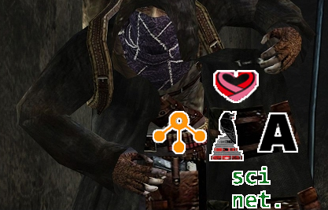
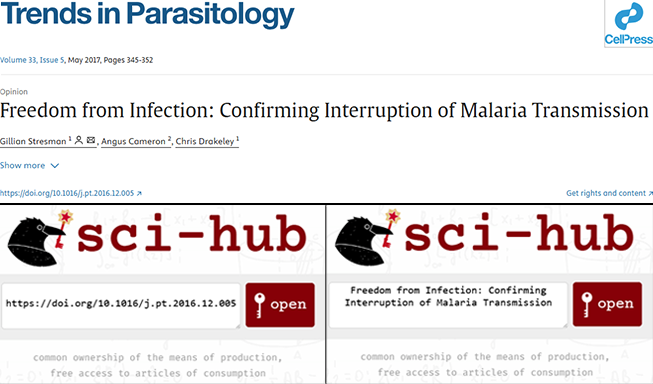
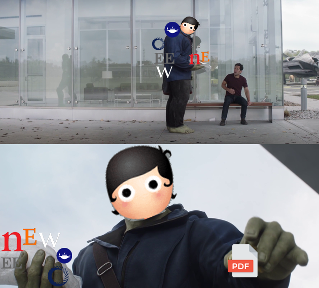

---
authors:
- admin
date: "2025-04-15"
featuredImage: "featured.png"
image:
  caption: 'LOL, Limewire animation. The name of the original author has been lost to time. [**From LOL! LIMEWIRE! - By iamapirate**](https://www.youtube.com/watch?v=Th6PW5VwDFI)'
summary: 'A guide to Sci-hub, Sci-net, Nexus, Wosonhj and SmartQuantAi, because paywalls are meant to be climbed.'
tags:
- No-code
title: "Colorful Open Access: A Hitchhiker's Tour of Free Libraries and Open Knowledge"
---

**[NOTE: This is a live WIP/Draft and subejct to a lot of changes]**

## You are a pirate

It doesn't matter what education level, titles attained, or how far into your professional or academic career you are.

Knowingly, unknowingly, from a friend, or a colleague of a friend.

You have, most definitively, read an article, paper or book that is behind a paywall and required a payment, but neither you nor the person who shared it with you paid for it.

It was obtained and shared from _unconventional_ methods.

<figcaption>Figure 1. "Got something that might interest ya!" - Quote from the first time you meet The Buhonero's (Merchant) in the videogame Resident Evil 4. The Buhonero sells weapons. </figcaption>

Here, I lay out these methods, the platforms, and other tools that have been, and are currently used, to access articles and books (accurate as of May 2025).

This text is for educational and research purposes only, similarly to the many other articles talking about this topic in prestigious scientific journals such as Nature, Science, among others.

So, you need to access an article, or perhaps a book. 

These are your options:

## Sci-Hub

Launched in 20XX by Alexandra ..., sci-hub is the most-well known website for the purposes of accessing pay-walled articles.

It is no secret that Sci-Hub has been fundamental to the research process for thousands (perhaps millions?) of researchers.

Who is downloading pirated papers from sci-hub? 

Well, [everyone](https://www.science.org/doi/10.1126/science.352.6285.508).

Using sci-hub is straightforward. You access the website, and in the search bar you provide either:

- The full title of the article

OR

- The DOI of the article

<figcaption>Figure 2. Example of how to search an article on Sci-hub using either the full title or the DOI.</figcaption>

Unfortunately Sci-hub only has articles up until ~2022, which means you won't be able to access most of the recent literature in here.

Additionally, you will only find scientific papers with a valid DOI. For books, you would need to use LibGen and search with a IBN code instead of a DOI.

## Anna's Archive

If you are looking for a wider range of texts, including books, comics, magazines, newspapers, among others, Anna's Archive should be the next place you should look into.

[Main image for anna's archive]

Unlike Sci-hub, which will return you an error if you don't carefully specify the title, here you can type the partial title or keywords of interest and it will return a list of options that match your query.

[Search example]

## Wosonhj / SmartQuantAi

If what you are looking for isn't in Sci-hub or Anna's Archive, Wosonhj AKA Smartquantai is your next best bet.

In this forum you make a public request for the article you want in exchange for points (coin emoji).

You get for free 50 points by making an account and 20 points for every day you log in. 

Requesting an article takes at least 10 points and more often than not, a good Samaritan will share it with you within a few minutes, given that the paywalled article is from a well-known library or journal.  (Elsevier, Willey, etc.)

<figcaption> Figure X. User from Wosonhj / SmartQuantAi shares a pdf with someone that does not have access to a paywalled scientific article. </figcaption>

First you make an account, next you post the article you are looking for, set a reward and you are done.

[Step by step image]

In my experience, it takes a couple minutes, if not seconds, for someone to share the article with you.

[Example of nature article submission]

No one else can access this file. Only you, the one requesting it, will be able to download it. 

After 10 days, the file is deleted from the website.

You may also get points from sharing articles you have access to with others, fulfilling their requests and obtaining the rewards. 

## Nexus Bots

If you have Telegram, another alternative is to access the library hosted by the Nexus project.

In short, this library contains data from the Z-Library, LibGen, and millions of other scientific papers uploaded by the users.

Similarly to Sci-hub and Anna's Library, you can search for your article of interest based on title or DOI.

[Example 1]

And if the article you need is not yet available, you can request it.

Same as the Wosonhj / SmartQuantAi Forums, you use points in your request. The key difference being that once an article is uploaded to the Nexus ecosystem, it remains accessible for everyone else in the future.

If you don't have telegram, you can access the STC website (updated on 22/02/2024 to libstcc website). 

If you see try a DOI and see this globe emoji, it means the article is available to be downloaded.

https://www.reddit.com/r/scihub/comments/13cms8m/how_to_use_nexus_bots_or_stc_to_download_the/

## Sci-net

The most recent platform to be added to this list is Sci-net, which was launched at the same time as I was writing this post.

You can think of Sci-net as a Sci-hub 2.0, both because it is the same founder, and because it implements the point system by taking it a step further with the implementation of cryptocurrencies. 

In order to access the platform, first you have to acquire the points (cryptocurrency) by downloading...

Next, you...

Finally, once inside the platform, you can search for your article of interest.

[Imagen]

Or request it if not available.

[Imagen]

## Straight from the source

If none if these options are appealing to you, you can always ask the Corresponding Author either directly through mail, or through other social networks like ResearchGate or LinkedIn.

Finally, I encourage you to pay for the article if you really want to :)

[Image of Nature barriers paywalled article]

<figcaption>Figure X. This meme is satire and the article is, in fact, free for access. Nevertheless, this meme has been shared everywhere and has been widespread on the internet for some years now.</figcaption>

## Words of caution

Limewire was, and now is once again, a peer-to-peer platform to share files, in this case, specifically for music. 

The disadvantage with this and the many other platforms that were mentioned is that malicious actors could upload malicious files or replace hyperlinks within the article that redirect to pishing websites.

<figcaption>Figure X. Your files could be laced with virus.</figcaption>

Being a pirate is great, but it does come with some risks and you should be careful out there not to click files called "not-a-virus.exe".

[Image dolphin not a virus]

## Footnote



