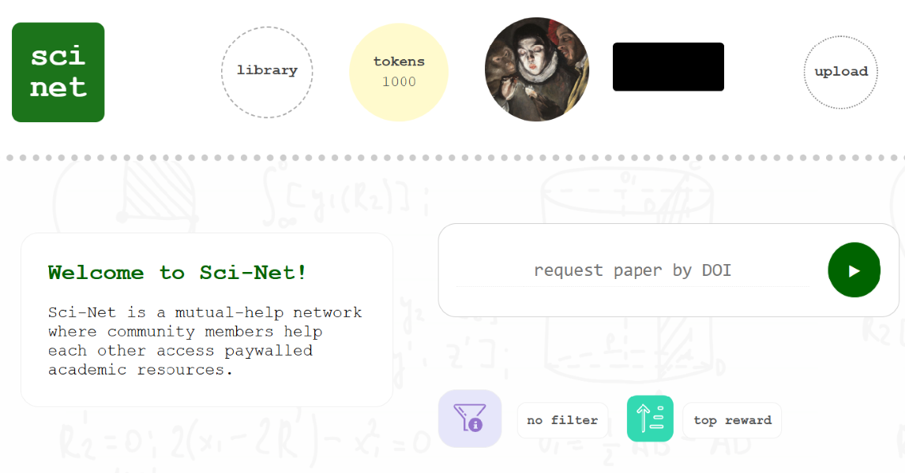
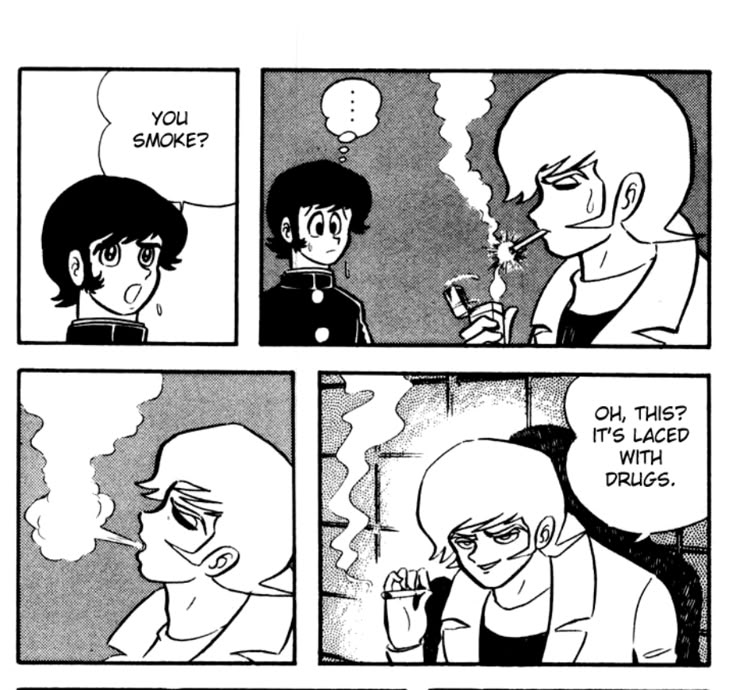

---
authors:
- admin
date: "2025-04-15"
featuredImage: "featured.png"
image:
  caption: 'Illustration by  サクヤ (x.com/7UU61): [**From ノウナイディスコ / IA [CeVIO AI] - By r-906**](https://www.youtube.com/watch?v=NMiQmumW0nI)'
summary: 'A guide to Sci-hub, Sci-net, Nexus, Wosonhj and SmartQuantAi, because paywalls are meant to be climbed.'
tags:
- No-code
title: "Sci-Hub and its alternatives: How to access and download research papers for free"
---

**[NOTE: This is a live WIP/Draft and subejct to a lot of changes]**

## You are a pirate

It is no secret that Sci-Hub has been fundamental to the research process for thousands (perhaps millions?) of researchers.

Who is downloading pirated papers? Well, [everyone](https://www.science.org/doi/10.1126/science.352.6285.508)

## Search based platforms 

Sci-hub/Anna's Archive = Search platforms

Wosonhj / SmartQuantAi = Forum based requests

Nexus Bot = In the middle of both 

### Sci-Hub

Sci-hub was founded on XXX by Alexandra Elbakyan.

Despite the database not being up-to-date since 2021, it remains a foundational tool for any researcher. It is a household name that everyone has encountered at some point. 

### Anna's Archive

## Points based platforms

### Nexus Bot

here are 2 ways which you can access an article through Nexus

Using the Telegram bots - this is my primary choice as it fetches the articles using realtime institutional access

The STC website (updated on 22/02/2024 to libstcc website) - my secondary choice. If you see try a DOI and see this globe emoji, it means the article is available to be downloaded.

https://www.reddit.com/r/scihub/comments/13cms8m/how_to_use_nexus_bots_or_stc_to_download_the/

### Wosonhj / SmartQuantAi

Great forum, quick turn around:

https://www.smartquantai.com/

## State of the art: Sci-Net

https://sci-net.xyz/

The next sci-hub, same creator.

Currently invitation only

<figcaption>Figure X. Main screen of Sci-Net.</figcaption>

## Words of caution

<figcaption>Figure X. Your files could be laced with virus.</figcaption>

## Footnote



